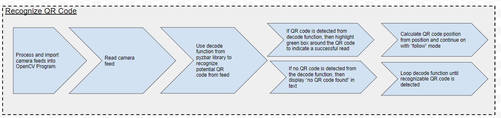
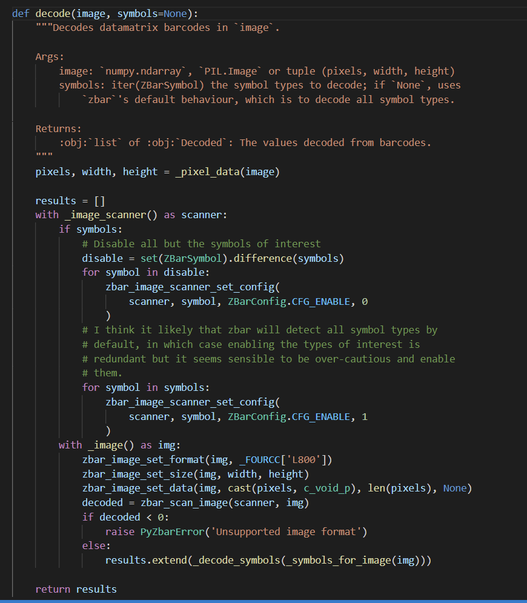
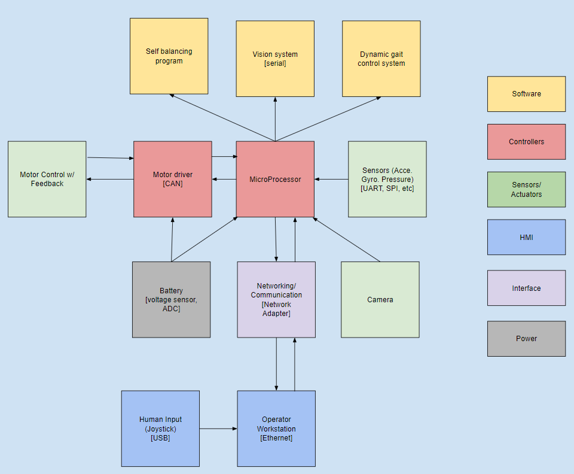

# Semester 1 Final Report

**MIT Cheetah Derivative Final Report**

**In Collaboration with S.E.P.T. and Axibo Inc.**

PROCTECH 4TR1: Capstone I

Instructor: Mostafa Soliman

Date of Submission: April 14, 2022

**Declaration Statement:**

This capstone report contains our own work for PROCTECH 4TR1 and has not been submitted, in whole or in part, towards fulfilling requirements in any other course, either at McMaster University or elsewhere.

I/We have read McMaster’s academic integrity policy and understand that plagiarism, whether intentional or unintentional, will be dealt with in accordance with university policy and practice.

| Name             | Student # |
| ---------------- | --------- |
| Adam Sokacz      | 400177446 |
| Amar Gandhi      | 400197665 |
| Dhanesh Manickam | 001422400 |

### Abstract 

This final report documents the progress and research done in the development of the MIT Cheetah Derivative progress in the first semester of capstone. All updates and changes made to the project since the midterm report are documented here, this includes a revised scope that removes the hardware component of the project and provides updated diagrams. The report goes over a comprehensive literature and research review, followed by an overview of the project design and the key design concepts involved. The project design covers the objectives and constraints as well as the system diagrams and technical details. UML diagrams such as use cases, state machines, system architecture diagrams, and process control loops have been created to outline the functionality of the quadruped. In addition to the research and planning that has been done, the early development progress on the gait generator, vision system and simulation are outlined. This includes preliminary C++, Python, and simulation code along with explanations of the concepts behind the code. Lastly, the future plans for the project are detailed along with the supplies that will be arriving for the project over the coming months. The future plans for the project outline the proposed work schedule, milestones and possible problems that might occur with strategies to mitigate these problems.

### Table of Contents 

**Abstract 2**

**Table of Contents 3**

**Executive Summary 6**

**Introduction 6**

The MIT Cheetah Project 7

MIT Mini Cheetah 7

SEPT-Axibo Cheetah Derivative 8

Community Partner Background 8

Faculty Sponsor Background 9

Project Goals 9

Operation 9

Major Modules / Subsystems 10

**Literature Review 11**

Dynamic Locomotion 11

Optimal Actuator Design 11

High-speed Bounding with the MIT Cheetah 2: Control Design and Experiments 11

Highly parallelized control programming methodologies using multicore CPU and FPGA for highly dynamic multi-DoF mobile robots, applied to the MIT Cheetah 11

Software and control design for the MIT Cheetah quadruped robots 12

Introduction to Robotics 12

The Beauty of Bezier Curves 12

2D and 3D Bézier Curves in C++ 12

ARTag, AprilTag and CALTag Fiducial Marker Systems: Comparison in 12

a Presence of Partial Marker Occlusion and Rotation 12

Gnuplot in Action 13

Transformation Matrix Guide 13

**Research Results 13**

Cheetah Biomimetics 13

Cheetah Mini Leg Assembly: 14

Motor Assembly: 16

Planetary Gearbox: 16

Gait Patterns 17

Mini Cheetah Kinematics Model 18

Joint Control Strategy 19

ROS2 20

ROS2 Versions: 21

Core ROS Concepts: 21

Control System 23

Industrial Standards 23

**Design Concepts and Project Design 24**

Objectives 24

Constraints 24

UML Diagrams 24

Design Criteria 27

Technical Details 29

Testing Kinematics and Pathing 29

Modeling Leg Position 29

Basic Pathing Algorithms 31

Linear Interpolation 31

Sampling Along a Bezier Curve 32

**Supplies 33**

**Completed Work 33**

Simulation and Visualization 33

RVIZ vs Gazebo 34

Creating a simulation 34

Setting up the workspace 34

Creating folders and files for the simulation 34

Launch folder 35

URDF 35

World folder 36

ROS teleop 37

QR Code Distance Processing 39

Deriving a Formula 39

Initialization 40

Calculating the Pixel Width 40

Converting to Grayscale 41

Applying Gaussian Blur 41

Detecting Edges 41

Determine the Bounding Box 43

Filtering the Results 46

Fiducial Markers 46

Hardware Options 47

Discussion **48**

Viability 48

Relevance 48

Future Problems 48

Spring/Summer Plan 49

Fall/Winter Plan 49

Connect to Literature 49

**Conclusion 50**

**References 51**

**Appendices 54**

### Executive Summary 

The SEPT-Axibo Cheetah derivative project is a collaborative effort between the capstone group, an engineering masters student and the community partner, Axibo inc, to create a quadruped robot. The goal of this project is to research and document quadruped design systems then use this information to contribute to the development of a cost-effective and commercializable product for Axibo inc. The scope of work that is dedicated to the capstone team is focused on the software and control system development for the quadruped. This includes integrating and testing the software on a physical robot, and since the hardware component is outside the scope of the capstone team, a pre-assembled quadruped will be provided.

This report begins with an introduction to the MIT Cheetah, the motivations behind the project members involved and the project goals. MIT has developed two versions of the Cheetah so far, the first being the original MIT Cheetah and the second being the MIT Mini Cheetah. This project will be focused on creating a derivative based on the MIT Mini Cheetah which was created as a research project through the MIT Biomimetics laboratory. Key project goals include demonstrating precise limb control, generating gait patterns, utilizing ROS, utilizing RViz/Gazebo for simulations, self balancing features, and a vision tracking system.

The literature review portion of this report documents the resources that were used to gain an initial understanding of quadruped robots and key design concepts. MIT’s research and development into quadruped robots is well documented and provided a foundation in concepts such as dynamic locomotion, optimal actuator design, and high-speed bounding. Additional material that was reviewed covered information on concepts like software, control systems, robotics, and pathing curves.

The research results section covers background information that will directly help in achieving the goal of this project. The leg assembly of the quadruped is one of the most important parts and results in the motor assembly, gearbox, gait patterns, leg kinemations, and joint control strategy are all documented in this section. The key concepts of ROS are also detailed in this section as it is an important part in the implementation of all of the robot’s components.

The design concepts and the initial project design are all detailed. Concepts such as inverse kinematics and modeling leg positions are explained in this section. The project design is described using objectives, constraints, and UML diagrams to show the functionality of the quadruped. The UML diagrams that were created include use cases, state machines, system architecture diagrams, and process control loops.

The last part of the report goes over the early development progress that has been made. The areas of focus here were the modeling of leg position, the quadruped simulation, and the vision tracking system. Screenshots and example code are provided to show the progress made in these areas. Finally, the details of the future plan for this project is outlined which includes timelines, milestones, and a risk mitigation strategy.

### Introduction 

### The MIT Cheetah Project 

The MIT Cheetah is an engineering research project that was developed through the MIT Biomimetics laboratory. The word _biomimetics_ describes using systems found in nature to inspire technological systems \[1]. The goal of this project was to design and build a quadruped robot that can emulate the same kinematic motion that is found in animals found in nature like the cheetah. This inspiration from nature drove the design of each aspect of the project, from limb design - the way that joints connect together in the leg and shoulder, to pathing - the way that the limb linkages coordinate together, to gait design - the way that the limbs work together to achieve a specific walking pattern.

>)

_**Figure 1: Original MIT Cheetah \[**_2_**]**_

There have been many direct iterations and forks of the original project as technology improved, funding for the project increased, and researchers with different specializations were able to leave their mark on the design. One very visible improvement was the consolidation of the control system. When the body weighs less and processing becomes more efficient, it allows for the size and strength of the materials to change while maintaining similar requirements for force output and durability.

### MIT Mini Cheetah 

The most prominent _fork_ of the original project was the MIT Mini Cheetah. It started as an initiative within the biomimetics laboratory lead by Ben Katz, an undergraduate student with a background in Mechanical Engineering. The MIT Mini Cheetah consolidated many of the lessons learned in previous iterations. It had a simpler control system in a robust body, and was able to be reproduced at a more cost effective price.

>)

_**Figure 2: MIT Mini Cheetah \[**_3_**]**_

This was also the project that gained international popularity that began from a video of the quadruped performing a backflip. Once this video circulated, the Mini Cheetah was seen on many news outlets, talk shows, and new media sources. Such rapid popularity at a time when the technology was becoming more affordable and open-source led to companies and individuals recreating the design, and eventual commercialization of similar products.

### SEPT-Axibo Cheetah Derivative 

As a core capstone team composed of 3 McMaster Engineering students from the Automation Eng. Tech. program and 1 McMaster Engineering student from the Manufacturing M. Eng. program, our goal is to create a derivative of the Mini Cheetah project. The complete scope of the project is to contribute towards a cost-effective and commercializable product for our community partner and perform the documentation and research for future initiatives and serve as an educational tool within the W.Booth School of Engineering Practice and Technology for our faculty sponsor. The modified scope for the core capstone team is to focus on the control system design and implementation aspect of the project and thoroughly document the details so that the project can be continued after our graduation.

Project Documentation: [https://sept-axibo-cheetah-9szwm.ondigitalocean.app/index.html](https://sept-axibo-cheetah-9szwm.ondigitalocean.app/index.html)

### Community Partner Background 

Axibo Inc. is a local startup company that is run by McMaster Engineering graduates across a variety of programs. They specialize in the application of automation systems in the film industry, and in many collaborative technology initiatives within the province. They have contributed to autonomous vehicle, edge computing, and robotics projects in the past. As their team expands, they plan to branch out from the film industry.

### Faculty Sponsor Background 

>)

The W.Booth School of Engineering Practice and Technology is a department within McMaster Engineering that provides Graduate programs, Undergraduate programs, Degree Completion pathways, and Professional Certifications. The goal of the department is to offer a unique project based curriculum in streams that have select industry focus.

The adjunct professor sponsoring this project is Dr. Ishwar Singh. His professional profile can be found at the following website:

[https://experts.mcmaster.ca/display/isingh](https://experts.mcmaster.ca/display/isingh)

### Project Goals 

* Demonstrate precise limb control
* Explain the inverse kinematic concepts to perform limb pathing
* Model a variety of pathing techniques
* Explain body coordination and posture estimation
* Explain gait and how a gait pattern generator will function
* Modify and existing ROS simulation to demonstrate the above kinematics
* Learn to develop packages within ROS or ROS2
* Learn simulation through either RVIZ or the Gazebo simulator
* Modify an existing simulation to work with our target hardware
* Integrate the simulation to that hardware
* Use vision processing to establish motion goals through fiducial markers

### Operation 

1. User powers on the quadruped
   1. Controlling hardware is booted
   2. Connection is established with the main station
   3. Join calibration sequence is run
   4. Quadruped actuates to it’s ‘ready position’
2. User selects an operational mode
   1. Manual control designates the input to the gait generator to come from the joystick or keyboard input
   2. Automatic mode designates the input to the gait generator to come from the fiducial marker tracking algorithm
3. Once the user is done operating the quadruped, they are able to safely disable it remotely
   1. For emergency situations, there will also be an E-Stop on the body of the quadruped

### Major Modules / Subsystems 

A system architecture diagram was made to decompose the quadruped robot to visually interpret the different subsystems within. This diagram indicates that there are 6 _subsystems_ within the overall quadruped system. Each component in the quadruped belongs to a different subgroup to help organize the quadruped system. For example, the battery belongs to the power subgroup. The software subgroup consists of the self balancing program, the computer vision program and the dynamic gait control system for movement.

>)

_**Figure**_ 3_**: Subsystem diagram**_

The _dynamic gait control_ system works by using predetermined walking patterns to calculate how the legs should move. The dynamic aspect comes in because the walking pattern will adjust to variances to keep the robot walking properly based on the feedback from the self balancing program. The self balancing program uses information from the on board accelerometer and gyroscope to calculate the external factors affecting the robot. This information is used to calculate how the robot should move to counter the disturbances and remain balanced, which is then used by the dynamic gait control system to determine where to move the feet to walk while remaining balanced.

### Literature Review 

**Dynamic Locomotion**

MIT Biomimetics Lab

_https://biomimetics.mit.edu/research/220579eb-7c43-403e-aebb-bbee478c4663_

Describes the locomotion testing of the original MIT Cheetah. The quadruped was equipped with force sensitive pads on each foot in order to detect the force distribution of each step. This data was graphed, analyzed, and used in the optimization of the design.

**Optimal Actuator Design**

MIT Biomimetics Lab

_https://biomimetics.mit.edu/research/0b02d0a6-b0d3-4011-bd95-183264a30217_

Describes the design of the revolute joints found in the MIT Cheetah leg assembly. It covers the models, gearing, and justifies the design decisions that were made.

**High-speed Bounding with the MIT Cheetah 2: Control Design and Experiments**

MIT Biomimetics Lab

_https://dspace.mit.edu/bitstream/handle/1721.1/119686/Bounding-IJRR-Park-Wensing-Kim.pdf?sequence=1\&isAllowed=y_

Describes the design of the gait pattern generator as well as the 3D force analysis for stabilization. These elements were described using vectors and matrices.

**Highly parallelized control programming methodologies using multicore CPU and FPGA for highly dynamic multi-DoF mobile robots, applied to the MIT Cheetah**

Seok, Sangok

_https://dspace.mit.edu/handle/1721.1/87982_

Describes the pipelining process for the NI cRio microprocessor and the parallel processing in the FPGA embedded within it. Also reviews the Trot running algorithm, which was developed for the project to move the leg in a 12-point bezier loop.

**Software and control design for the MIT Cheetah quadruped robots**

Di Carlo, Jared(Jared J.)

_https://dspace.mit.edu/handle/1721.1/129877_

A report that outlines the specifications of the MIT Cheetah Mini project. It covers everything from a general hardware overview to the simulation and dynamics models used.

**Introduction to Robotics**

Craig, John(John J.)

_https://www.pearson.com/us/higher-education/product/Craig-Introduction-to-Robotics-Mechanics-and-Control-3rd-Edition/9780201543612.html_

The kinematic concepts found in this book were reviewed to reacquaint the team on forwards and reverse kinematics.

**The Beauty of Bezier Curves**

Freya Holmér

https://www.youtube.com/watch?v=aVwxzDHniEw\&t=788s

A video that explains the mathematics around bezier curves visually. This video greatly assisted in Adam’s understanding of bezier pathing.

**2D and 3D Bézier Curves in C++**

Markus Buchholz

_https://medium.com/geekculture/2d-and-3d-b%C3%A9zier-curves-in-c-499093ef45a9_

Demonstrated how to implement nth node bezier curves in C++. Adam’s implementation was based on this one.

**ARTag, AprilTag and CALTag Fiducial Marker Systems: Comparison in**

**a Presence of Partial Marker Occlusion and Rotation**

Artur Sagitov, Ksenia Shabalina, Leysan Sabirova, Hongbing Li, Evgeni Magid

_https://www.scitepress.org/papers/2017/64789/64789.pdf_

This paper compared the different marker types that are typically used in robotics. These markers are used to assist vision systems in localizing the robot.

**Gnuplot in Action**

Philipp K. Janert

_https://www.manning.com/books/gnuplot-in-action-second-edition_

This textbook was used to automate the 3D graphing of coordinate points and coordinate transformations in the team’s C++ programs.

**Transformation Matrix Guide**

_Alex2539_

_https://docs.rainmeter.net/tips/transformation-matrix-guide/_

Overviewed how to apply matrix transformations to 3D coordinate vectors.

### Research Results 

### Cheetah Biomimetics 

| Human Skeleton                                                                                                                       | Cheetah Skeleton                                                                                                                       |
| ------------------------------------------------------------------------------------------------------------------------------------ | -------------------------------------------------------------------------------------------------------------------------------------- |
| 

<em><strong>Figure 3: Human skeleton [4]</strong></em>
 | 

<em><strong>Figure 4: Cheetah skeleton [5]</strong></em>
 |

There is a striking difference between the leg of a human when compared to a quadruped mammal like a cheetah. The difference can be summarized as a result of _function_ and _efficiency_.

Environmental influence played a large role in how these two animals would have developed. Humans specialize in collaboration and tools to catch food which resulted in the leg being optimized to conserve energy for long distance travel\[6]. This is in contrast to the strategy of the cheetah which uses its muscle and skeletal structure to its advantage in order to outrun prey at short distances. “He relies on his eyesight to locate prey and then sidles up to within 50 yards of his meal before engaging his legs to spring into action and charge at full speed” \[7].

One fascinating note is that the cheetah can be observed as running on its toes while humans utilize more of our feet in the process \[8]. This, paired with more flex of their spine when exercising asymmetric gait patterns is what leads to an increased stride length.

The last important distinction between the two is _bipedalism_ in contrast to _quadrupedalism_. One characteristic of bipedalism is the presence of an arch in the foot, which promotes energy conservation by adjusting the energy distribution of the impact and lift off. Another characteristic of bipedalism is “enhance\[d] development of the hamstring, buttock, and anterior thigh muscles (as hip and knee extensors), which are vital for athletic bipedalism.” \[9].

The original cheetah leg design was a more precise mimic of the cheetah animal’s 3-linked leg:

>)

_**Figure**_ 5_**: Original cheetah leg design\[**_10_**]**_

### Cheetah Mini Leg Assembly: 

The Mini Cheetah took a different approach to the leg design than the original project. In comparison, it is missing the thigh linkage. This affects the stride and maximum extension of the leg assembly but leads to a simpler mechanical assembly and kinematic model.

>)

_**Figure**_ 6_**: Leg joining diagram \[**_11_**]**_

Each leg is a 3-motor system with feedback position control. Two motors are mounted together in parallel inside the knee assembly. One motor actuates the angle of the _upper link_ while the second motor in the knee assembly actuates the angle of the _lower link_ with the use of a belt and pulley system. More robust quadrupeds may opt for a chain and gear system instead. The _lower link_ is mounted directly to that pulley which intersects both links, changing the angle according to the gear’s rotational position.

>)

_**Figure**_ 7_**: Hip abduction-adduction example**_

The _hip linkage_ is made up of the third motor in the leg assembly. This perpendicularly mounts to the knee assembly and performs the abduction-adduction motion of the leg assembly. _Abduction_ is the pivot away from the body and _adduction_ is the pivot towards the body. The diagram above demonstrates the abduction of the left leg assembly while the right leg assembly remains in its stationary position.

**Motor Assembly:**

>)

_**Figure**_ 8_**: Motor assembly exploded view \[**_12_**]**_

The assembly consists of an outrunner brushless motor built into a planetary gearbox. The MIT Cheetah Mini uses a 6:1 gearbox to increase the torque output of the revolute joint. The specifications of this motor are 24V at 7A. It produces a nominal torque of \~7.5 N\*M at a nominal rotational speed of 250 rpm.

**Planetary Gearbox:**

>)

_**Figure**_ 9_**: Planetary gearbox example \[1**_3_**]**_

The primary benefit of a planetary gearbox over other gearing systems is its form factor. They provide a high rate of energy transfer per unit volume in an _enclosed assembly_. The motor shaft is typically fixed to the sun gear while the carrier is fixed to the centre of each of the 3 planetary gears. Each planetary gear is allowed free rotation while being mounted to the carrier because of the bearings that connect the two parts together.

>)

_**Figure**_ 10_**: Planetary gearbox example 2 \[1**_4_**]**_

With a fixed non-rotating ring gear, the carrier output power is the input power modified by the gear ratio. Planetary gearboxes can be implemented in stages for additional reductions, however _multi-stage revolute joints_ are not suited for quadrupeds due to the additional weight and material on each joint.

**Gait Patterns**

Gait can be described as: **A manner of walking**

The following video animates a variety of gait patterns for quadruped mammals:

[https://youtu.be/AZGNjKolAiQ](https://youtu.be/AZGNjKolAiQ)

The following video shows a quadruped robot emulating a trotting gait pattern:

[https://youtu.be/T1zNwrpLASc](https://youtu.be/T1zNwrpLASc)

Within the quadruped robot’s _software stack_, packages must be created that coordinate this motion based on either input from the user or input from the environment.

Simple algorithms coordinate motion independently from environmental stimuli, while more complex packages can adapt the _gait pattern_ to these stimuli. An example of this is coordinating leg position on uneven terrain or abrupt pushes from an outside actor.

_**Figure**_ 11_**: Sophisticated gait control \[1**_5_**]**_

Information is gathered from the environment through sensors. An acceleration sensor can determine the direction of gravity and give a reference point for the roll and pitch of the quadrupeds torso. In some quadruped designs, an array of force sensors on each foot can determine the weight distribution of a quadruped in an environment at steady state, or the force of impact of each foot. This information can modify the gait design through control strategies like PID or LQR.

One such gait trajectory optimization ROS package is called TOWR. It is based on the Eigen C++ library for linear algebra, matrices, and algorithms.

[http://wiki.ros.org/towr](http://wiki.ros.org/towr)

Two other options are:

FreeGait -[ https://github.com/leggedrobotics/free\_gait](https://github.com/leggedrobotics/free\_gait)​

MOVEIT -[ https://moveit.ros.org/](https://moveit.ros.org/)

A video of it running in the RVIZ visualization tool can be found here:

[https://youtu.be/nwnTa4XC3D8](https://youtu.be/nwnTa4XC3D8)

A simple gait algorithm can be created using coordinate vector transformations and basic kinematics but professional simulation packages are significantly more mathematically complex and efficient.

**Mini Cheetah Kinematics Model**

The kinematics of each leg of the Mini Cheetah can be described as a _2D + 1D model_. This is because the leg only moves along a 2D plane and it is the responsibility of the hip joint to abduct/adduct the 2D motion to reach a 3D coordinate.

>)

_**Figure**_ 12_**: 2D+1D sketch**_

**Joint Control Strategy**

In the MIT Cheetah, each joint is fitted with an all-in-one brushless motor + encoder + controller assembly. The controller has its own local PID which can or cannot be further configured, depending on the manufacturer. The main computer communicates with the 12 controllers through commands or instructions.

One such proprietary implementation of a joint controller is communicated with over CAN in the following way:

Example Position Control Instruction:

| Device ID | Data Seg. | Host Addr. | Pos. | 0x00 | Accel. | 0x00 | Target Speed | Pos. L. | Pos. H. |
| --------- | --------- | ---------- | ---- | ---- | ------ | ---- | ------------ | ------- | ------- |

| _**Device ID**_        | A unique identifier must be set for each node on the network.                                                                                                                                                                                                     |
| ---------------------- | ----------------------------------------------------------------------------------------------------------------------------------------------------------------------------------------------------------------------------------------------------------------- |
| _**Data Segment**_     | The number of bytes that will be expected for the instruction. This instruction uses 8-bytes.                                                                                                                                                                     |
| _**Host Address**_     | The address of the primary node on the network.                                                                                                                                                                                                                   |
| _**Position**_         | A 16-bit value. Because of this, the value is stored as two 8-bit numbers. For example, if the position value is 22 000 which represents b’0101 0101 1111 0000, the low position value will store b’11110000 while the high position value will store b’01010101. |
| _**0x00 Instruction**_ | Indicates the type of motion instruction. The hexadecimal value 0x01 represents position control.                                                                                                                                                                 |

Feedback control uses an encoder that is mounted inside of the planetary gearbox assembly and measures the rotation of one of the planet gears. The reading is then modified using the gear ratio to produce an accurate position.

There are open-source implementations of quadruped joint controllers, but they require a high-degree of embedded systems and brushless motor control expertise, a small list of supported hardware, and a lot of time to set up.

Revolute joint controller firmware produced by Ben Katz, the architect of the Mini Cheetah project, is available for the STM32 platform on his ARM MBED profile which can be found at this url:

[https://os.mbed.com/users/benkatz/](https://os.mbed.com/users/benkatz/)

### ROS2 

ROS2 is _middleware,_ a layer of software packages between the operating system and the development environment designed for the programming of robotic systems. It includes a _build system_, package structure, and a variety of standards that define the way a variety of software packages communicate with each other. ROS2 is designed with reusability in mind. The software components on one system can be transferred to another without any or very little modification.

In this project, we are planning to use ROS2 rather than ROS1. This is because of its improvements in security, performance, and because our faculty sponsor asks that we look into this emerging technology. ROS2 is in all ways a successor to ROS1, but it takes time for the ecosystem to transition over. This is why both middleware are being developed in parallel for the time being.

#### ROS2 Versions: 

_**Figure**_ 13_**: Recent ROS2 releases \[1**_6_**]**_

#### Core ROS Concepts: 

What is a ROS Node?

A ROS node is an individual software task that communicates with other tasks within and outside of its package.

What is a ROS Topic?

A ROS topic is the result of a client-server pair of packages that communicate with each other through asynchronous publish-subscribe messages.

What is a ROS Service?

A ROS Service is a synchronous communication api that allows nodes to exchange _non-preemptable_ information. The datatypes of the structured communication being sent is defined in a _msg_ file, as well as the datatype of the mandatory response.

What is a ROS Action?

A ROS Action is a synchronous communication api that allows nodes to exchange _preemptable_ information.

What is a ROS Launch File?

A ROS Launch file is an XML formatted script that has a few tasks. It starts and nodes that need to be working for the robot to function. It sets any configuration rosparam variables. It references the ROS controller stack if that feature is being used. Lastly, it launches any preconfigured simulation files.

What is a Makefile?

A makefile is a text file that sources all the dependencies required to build the software package. It also specifies details like compiler and versions used.

What Languages are ROS Packages Programmed In?

The main two languages that dominate the ROS ecosystem are C++ and Python. C++ is used in algorithms and hardware interfaces that crave efficiency. Python is used in the API’s that are accessible to developers to program robot functions. Support for other languages can be hit or miss, but there are many open-source compatibility layers available.

The following diagram shows the directory structure of most professional ROS packages:

>)

_**Figure**_ 14_**: ROS2 package structure**_

**Control System**

A handful of control systems will all be running simultaneously working together to keep the quadruped walking stably. Due to this complexity the control system will be built in a software stack with many of the core features having their own dedicated software packages and communicating with the other packages to relay information. It is important to build the control system in this way from the ground up as it will naturally organize the code in a logical way. This will greatly aid in the development and troubleshooting of the control systems. ROS is ideal here to serve as the middleware for all of these subsystems as it allows for programming in C++ and python as well as offering communication between these packages using ROS topics.

_**Figure**_ 15_**: Cheetah Mini control system \[1**_7_**]**_

An example of how the control system can be broken down into smaller subsystems is shown above from the original MIT Cheetah. The key subsystems that will be developed or integrated for this project will be the gait scheduler, leg swing control, vision tracking system, balance control program, and PID motor controller.

**Industrial Standards**

One of the learning objectives and criteria from the faculty sponsor of this project is to use the ROS2 middleware. ROS2 has a structured API for communicating between units of concurrent code called _Nodes_. The API uses a communications technology and standard called _Data Distribution Service_ or DDS. DDS is maintained by a standards organization called _Object Management Group_ (OMG).

The hardware communications technology that was specified by the community partner is called _Controller Area Network Bus_ or CAN Bus. It is a standard communications protocol developed by the automotive industry for reliable communication between microcontrollers without requiring direct connection to a host computer. CAN is internationally standardized as ISO 11898.

### Design Concepts and Project Design 

### Objectives 

**Maneuver** - The quadruped must be able to maneuver through a variety of terrain. This is the primary advantage of legged robots over wheeled robots.

**Balance** - The quadruped must be able to maintain its posture when acted on by an outside actor or uneven terrain while positioned statically or executing a gait pattern.

**Control** - There must be two modes of control; automatic and manual. Automatic control will coordinate the gait based on visual tags that are analyzed by an image recognition algorithm. Manual control will operator teleoperation either through the keyboard or controller input.

**Usage** - The quadruped must have a reasonable battery life. The battery life should not cripple its usability.

**Interface** - A graphical user interface will be developed for the operator workstation.

### Constraints 

**Maneuver** - Weather conditions such as rain, hail, and snow will limit the quadrupeds effectiveness at traversing terrain. This includes the impact that this weather has on the terrain like slippery rocks and mud. The quadruped should not be operated during these conditions.

**Balance** - The quadruped will be able to traverse down slopes up to 40° and up slopes up to 60°.

**Control** - Both operational modes must operate with reasonable delay and in a safe way.

**Usage** - The weight of the robot must not damage the quadruped after hours of usage.

**Interface** - The user interface must be clean and easy to operate for a skilled technician.

**Budget** - The cost of all materials should not exceed $35 000.00. Included in that figure, the mechanical components without bulk discounts will approximately cost $23 000.00.

### UML Diagrams 

Throughout the research and design process, the core capstone team constructed a variety of diagrams to better communicate our understanding of quadruped design, de-aggregate subsystem components, and set thoughtful goals for the future.

>)

_**Figure**_ 16_**: Use Case Diagram**_

The two most important use case scenarios are detailed below.

Manual Control Scenario

1. Turn on robot from HMI
2. Initialize robot to stand and run self balancing program
3. Robot waits for commands from HMI (joystick)
4. Robot receives move command
5. Use dynamic gait control system to execute move, while using accelerometer data to balance
6. Repeat steps 3-5 until ready to turn off
7. Power down command given. Robot lowers to a resting position and powers down

Follow mode scenario

1. Turn on robot from HMI
2. Initialize robot to stand and run self balancing program
3. Set to follow mode
4. Camera system searches for QR code
5. Once QR code is found calculate path to setpoint
6. Use dynamic gait control system to execute move, while using accelerometer data to balance
7. Repeat steps 4-6 until follow mode is stopped
8. Power down command given. Robot lowers to a resting position and powers down

>)

_**Figure**_ 17_**: State diagram**_

### Design Criteria 

The design for this robot will be a derivation of the MIT Mini Cheetah. The robot will have four legs each with three actuators allowing for 3 degrees of motion. The design will be exclusively on the software and controls system side. A preassembled quadruped robot will be provided which takes care of all of the hardware components.

The concepts used in the design of this robot will include inverse kinematics, motor control, process feedback and control loops(PID), computer vision, and programming. For the programming side, C++ and Python will be used in conjunction with ROS middleware. The majority of the functions and locomotion processes will be done in C++ and the vision system and follow mode pathing will be done in Python. ROS will serve as the middleware for the C++ and Python code, as well as running simulations using Gazebo and visualization using RViz.

>)

_**Figure 18: Inverse kinematics model \[1**_8_**]**_

Inverse kinematics is the concept of determining the angle of each joint to position the end point at a desired location. The challenge with inverse kinematics is that there can be multiple solutions to position the joints to achieve the same end position. Due to this further analysis is required to determine which solution is optimal.

There are multiple methods that can be used in _inverse kinematic calculations_. Three of the methods are trigonometry, Jacobian matrix method, and the trial and error approach. The trigonometry method uses simple trigonometry calculations as an effective approach when dealing with a low number of joints. The Jacobian matrix method uses matrix calculations to solve for the solutions and is the preferred method when there are many joints in the arm (4+). Lastly, the trial and error method is a brute force approach to finding a solution through incremental testing. This is a viable method when using software to compute the results however it is slow and inefficient. For the application of a quadruped robot, fast continuous calculations will be required therefore the trigonometric and Jacobian matrix method is preferred.

The use of inverse kinematics will be a key concept that will be used in programming the locomotion of the quadruped. The robot will have 4 legs, each with 3 degrees of freedom. With each move of a leg the inverse kinematics will have to be calculated to determine what angle to position each of the three motors at while also eliminating non-optimal solutions. Since these calculations will have to be done in real-time on the robot, it is important that the calculations can be done quickly. This means that the trigonometry and the Jacobian matrix methods would be optimal as the trial and error method is slower and far less efficient.

_**Figure**_ 19_**: Process Control Loop**_

The general feedback control loop is shown above. It begins with the _setpoint_ into the system, which in the case of the manual control mode will be the joystick input and for the follow mode the setpoint will be the motion instructions generated by the camera pathing system. The setpoint is a vector broken down into an angle on the XY horizontal cartesian plane for the direction and a velocity for the magnitude.

The setpoint then goes onto the _Gait Generator_ which determines the positions of the feet. The gait generator will have 4 outputs; one for each foot. The Gait Generator in this system will have multiple modes of motion including, crawling, trotting, and walking. Each of the 4 legs will have its own control loop for executing the commands from the gait controller. Using the position of the feet from the Gait Generator, inverse kinematics is done to determine the angles to move each motor to.

The output of the inverse kinematics becomes the setpoint to the PID control loop, with positional feedback from the encoders on the motor. The PID will be the one that controls the actual motors on the robot and what the response curve will be like. The robot will have an additional feedback loop that registers disturbances affecting the robot using the on board sensors and sending that information to the balance control block which will adjust the setpoint to try and correct for these disturbances.

### Technical Details 

#### Testing Kinematics and Pathing 

**Modeling Leg Position**

As mentioned in the research section of this report, the Mini Cheetah and our proposed derivative use a 2D + 1D kinematic model. There are two parts that work together to accomplish this; the hip assembly and the knee assembly. The motion of the knee assembly is restricted to that 2D plane, however the abduction/adduction of the hip allows it to orient in 3D space.

_**Figure**_ 20_**: 3D space broken down into a 2D plane + an angular position**_

When performing inverse kinematics, checks can be made to ensure that the position is within the sphere of reach of the quadruped leg. To do this, the magnitude of the coordinate vector can be solved for and compared to the length of each link in the leg assembly. Limits can also be set for each angle.

The following is an example in 2D:

_**Figure**_ 21_**: Magnitude of coordinate vector**_

In 3D it works much the same way:

c = sqrt(x2 + y2 + z2)

The 2D component of the compound motion can be solved using the following C++ method:

_**Figure**_ 22_**: 2D inverse kinematics**_

Where thetaOne represents the top angle of the knee assembly and thetaTwo represents the bottom angle.

The 3D version of this function can be implemented as such:

_**Figure**_ 23_**: 3D inverse kinematics**_

It works by breaking down the 3D coordinates into 2D coordinates of the knee assembly and an angle of the hip required to reach those 3D coordinates.

### Basic Pathing Algorithms 

**Linear Interpolation**

In order to interpolate between two points in 3D space, the problem must either be modeled as a system of linear equations or a matrix representing the system. In the implementation below, The first approach was used because it seemed more intuitive.

_**Figure**_ 24_**: Gnuplot linear interpolation output**_

_**Figure**_ 25_**: Linear interpolation sampling function**_

The method requires an _instruct\_t_ variable which contains a 3D coordinate, a number of samples, and an exponential value to sample at.

* The first step is to get a unit vector of the goal with respect to the initial coordinate.
* Then the initial coordinate is retrieved.
* Next, the exponential value is used to find a fractional percentage between \[0, 1].
* Each step along the linear path is then the previous x, y, z value + the direction vector \* the percentage of range found by the exponential function \* the magnitude of the target vector.
* This process is looped until the number of samples is completed and the fractional percentage = 1.00.

**Sampling Along a Bezier Curve**

_**Figure**_ 26_**: Gnuplot n’th node bezier**_

_**Figure**_ 27_**: Cubic bezier curve animation**_

_**Figure**_ 28_**: Bezier function**_

_**Figure**_ 29_**: Iterative binomial function**_

### Supplies 

Below is a list of supplies for this project. The majority of the supplies are for the testing and development phase prior to receiving the pre-assembled robot that will be used for the final product. Standard equipment that is already owned are not included in the list such as laptops for programming, and various standard cables.

| Name                                             | Description                               | Price | Supplier |
| ------------------------------------------------ | ----------------------------------------- | ----- | -------- |
| 
Freenove Robot dog kit

P/N: FNK0050
 | Small robot dog for use with raspberry pi | $170  | Amazon   |
| Raspberry pi                                     | Model B Quad Core 64 bit                  | $170  | Amazon   |
| Unitree Go1 robot dog                            | Full sized premade quadruped robot        | $3500 | Unitree  |
| 
14 AWG wire

P/N:‎22957551
           | 50’ 14 gauge nylon jacket - red           | $28   | Amazon   |
| 
22 AWG wire

P/N:WH22-09-100
         | 100’ 22 gauge - white                     | $20   | Amazon   |
| 
24V 200W PSU

P/N: RSP-200-24
        | Mean well 24V 202W PSU                    | $83   | DigiKey  |

Figure 30: Supplies table

### Completed Work 

### Simulation and Visualization 

When developing robots of this complexity, it is very beneficial to start the development in a virtual environment before applying it to the real world robot. This approach has many benefits such as faster development speed, safety, and damage mitigation. The setup process of a simulation environment can be time consuming, however, it is significantly quicker than producing a physical quadruped. Additionally, testing iterations in a simulated environment is much faster as everything is being done on the workstation and does not need to be transferred to the robot. Testing on physical hardware also introduces safety risks and risk of damaging hardware. Having a simulation to test with before running the code on the robot will give an idea of how the robot will behave which will _mitigate_ some of the risk. While waiting for the robot hardware to be available, a simulation and visualization environment is being developed so that further development and testing can begin.

#### RVIZ vs Gazebo 

RVIZ is a _visualization tool_ within ROS that can be used to _visualize_ what the robot is doing in a virtual 3D world. Gazebo is a simulation tool that can also be used to visualize the robot in 3D space with added simulation benefits such as gravity, inertia, and friction. For the development of our quadruped, both will be used. First by creating a gazebo simulation for virtual testing, then once we have our physical robot, we can use RVIZ to run a virtual replica of what should be happening on the physical robot. Having an RVIZ simulation running in conjunction with the physical will help with testing and troubleshooting.

#### Creating a simulation 

**Setting up the workspace**

The first step is to create a workspace for the project. This can be done by creating a workspace folder and a src folder within that then running catkin\_make to create the workspace files.

Example:

mkdir simulation\_ws

cd simulation\_ws

mkdir src

catkin\_make

The next step is creating a package within the src folder of the workspace for all the simulation files. This can be done using catkin\_create\_pkg, while in the src folder.

Example:

cd simulation\_ws/src

catkin\_create\_pkg robot\_simulation

#### Creating folders and files for the simulation 

Within the simulation package that was created, the three base folders and files that need to be created are:

· launch folder

o world.launch file

· urdf folder

o robot.urdf file

· world folder

o empty.world file

#### Launch folder 

The launch folder will contain all of the .launch files for the simulation. Launch files are used to execute and run the simulation. There are four basic functions within a launch file.

Arguments (\<arg name=”” default=”” />), which are essentially variables that can have a name and a default value and are used to pass those values into the simulation. Common arguments for a launch file would be \[x, y, z, yaw, pitch, roll] arguments to set the initial robot position and orientation.

Include (\<include file=”” />), is used to bring in information from outside the launch file and can include other launch files and arguments.

Parameters (\<param name=”” command=”” />, are used to assign a command to a given name. An example of this would be to like a file to a name which can then be used as values for arguments.

Nodes (\<node name=”” pkg=”” type”” args=”” />). Nodes are what launches the simulation. Depending on the package (pkg) and the determines what type of simulation it is. Using “gazebo\_ros” will start a gazebo simulation and using “rviz” will start an rviz simulation. The arguments of the node outline all the information that will be passed into the simulation like the urdf file that’s being used, which model, and the position arguments.

#### URDF 

_Unified Robot Description Format_ or URDF is the file format used for describing the elements of a robot. It is an XML file format that uses links and joints to describe the robot. Links are defined using multiple parameters and then joints are defined to connect links together.

To create a basic RVIZ URDF, that can be used for visualization, the following parameters will be commonly used:

· \<link name=””>: Used to create links with a unique name

o \<origin>: specifies the starting position of the link

o \<visual>: Identifier for visual parameters

o \<geometry>: Used to specify the size and shape of the link. Eg \<box>, \<cylinder>

o \<material>: Specifies material parameters such as colour

o \<mesh>: 3D model files can be used to visually represent the link

· \<joint name=”” type=””>: Used to create joints. The different types of joints are revolute, continuous, prismatic, fixed, floating, and planar

o \<origin>: specifies the starting position of the joint

o \<parent link=””>: Select which parent link the joint will be connected to

o \<child link=””>: Select which child link the joint will be connected to

o \<limit>: Specifies various limits for the joint such as range of motion

o \<axis>: Specifies the axis of movement for the joint

To create a URDF that can be used for a Gazebo simulation, additional parameters must be specified on top of the ones outlined above, such as mass, collisions, and inertia:

· \<link name=””> - Additional specification need for simulation

o \<collision>: Used to specify the geometry of the link that will be used in collision calculations

o \<mass value=””>: Used to specify the mass of the link

o \<inertia>: Used to specify the inertial values for the link

· \<gazebo reference=””>: Used to reference a link to specify additional physical properties

o \<kp>: Specifies the static pressures the material can handle. High values for hard materials and smaller values for softer materials

o \<kd>: Specifies the dynamic pressures the material can handle. High values for hard materials and smaller values for softer materials

o \<mu1>: Friction coefficient

o \<mu2>: Friction coefficient

#### World folder 

The world folder will contain all the .world files for the project. The world files is what is used to describe the environment for the Gazebo simulation and is what the robot models will be spawned into.

A simple empty world is described below:

\<world name="default">

\<include>

\<uri>model://ground\_plane\</uri>

\</include>

\<!-- Light source -->

\<include>

\<uri>model://sun\</uri>

\</include>

\<!-- World camera -->

\<gui fullscreen='0'>

\<camera name='world\_camera'>

\<pose>4.927360 -4.376610 3.740080 0.000000 0.275643 2.356190\</pose>

\<view\_controller>orbit\</view\_controller>

\</camera>

\</gui>

\</world>

This basic world includes a ground plane, a light source, and a camera. Many other aspects of the world can be customized such as changing the level of gravity using the \<gravity> tag.

#### ROS teleop 

With a working simulation the next thing to do is to control the robot. ROS teleop can be used for this. IT runs in a separate terminal and can take keyboard inputs from your computer and use it to control the simulated robot.

Example of a teleop terminal:

_**Figure**_ 31_**: Keyboard-teleop**_

**Champ Robot Simulation**

The current simulation being used in the research and planning phase is the Champ Robot Simulation. Champ is an open-source collection of quadruped code on GitHub. It contains many files and programs including RViz and Gazebo simulations. It is being used as a resource while developing the project specific simulation that will be used to test the programs and systems that will be developed. A screenshot of the simulation running on a virtual machine is shown below.

#### &#x20;

_**Figure**_ 32_**: Champ simulation testing**_

### QR Code Distance Processing 

An objective for this project is for the quadruped robot to track and follow an individual from a certain distance. This has been done using QR codes. In order for this to happen, the quadruped needs to recognize the QR code in real time and calculate the distance to get to that position. So far, this concept has been tested using Python OpenCV.

#### Deriving a Formula 

To calculate the distance of an object from a camera, the focal length of the camera must be calculated in order for the camera to comprehend distance. To relate the focal length and distance, the triangle similarity can be used. Triangle similarity involves an object with a known width being placed at a known distance. It also takes the apparent width of the object in an image capture. This measurement is in pixels. Thus, the focal length can be calculated:

Focal Length = (Pixel Width \* Known Distance) / Known Width

After focal length has been calculated, the distance can be computed by multiplying it with the known width. This is then divided by the pixel width, to get a distance measurement.

Distance = (Known Width \* Focal Length) / Pixel Width

Therefore, in order for the distance to be computed, the QR code first needs to be placed at a known distance from the webcam.

#### Initialization 

For this example, the QR code is first placed on a flat vertical wall, 50 inches away from the camera.

_**Figure**_ 33_**: QR Code at known di**_stance

To identify the QR code in the image, a function is defined in the program. The above image is the one that is being passed into the function. Again this image is of a known distance of 50 inches. This function’s goal is to identify the QR code as an object within the image and then calculate the apparent width of the object in pixels, to then use later on for the distance function.

#### Calculating the Pixel Width 

In order to calculate the distance, the focal length is required. However, the focal length requires the pixel width. This is why the image shown above is required. It acts as an initialization step so that a focal length can be computed for the camera.

def find\_FirstQR(image):

\#Converting frame to grayscale, blur, and detecting edges using these cv2 functions

gray = cv2.cvtColor(image, cv2.COLOR\_BGR2GRAY)

gray = cv2.GaussianBlur(gray, (5, 5), 0)

edged = cv2.Canny(gray, 35, 125)

\#find contours to determine edges

contours = cv2.findContours(edged, cv2.RETR\_LIST, cv2.CHAIN\_APPROX\_SIMPLE)

contours = imutils.grab\_contours(contours)

c = max(contours, key = cv2.contourArea)

\#make bounding box for the paper

return cv2.minAreaRect(c)

_**Figure**_ 34_**: Image processing**_

**Converting to Grayscale**

The function above, takes the image as a parameter and uses several OpenCV functions to help identify the object. First, the image is converted to grayscale as this will help with noise reduction. The function cvtColor can be used by taking two parameters. The first being the image being converted, while the second being COLOR\_BGR2GRAY. This converts the image into grayscale format.

**Applying Gaussian Blur**

Next a gaussian blur is applied to the new grayscale image for smoothing and noise reduction. The GaussianBlur function applies a low pass filter that removes all the high frequency components of the image. This is done by using a gaussian kernel, which is a 2 dimensional box. This box averages out the pixels within a box that runs between each pixel, causing a blurring effect. The first argument it takes is the source image, which is the previously defined grayscale image. Next it takes the size of the gaussian kernel. Note that both the height and width of the gaussian kernel has to be positive and odd. In this case, the height and width are both set as 5. The blur of the image increases as the kernel size increases.

**Detecting Edges**

After the blur has been applied, the edges of the object can now be detected through the Canny function. This function is an edge detection algorithm that follows 4 steps.

1. Noise Reduction
2. Determine Intensity Gradient
3. Non-maximum Suppression
4. Hysteresis Thresholding

First in order for the canny function to be accurate, it requires noise reduction as edge detection is easily skewed by noise in an image. This has already been done by using a 5x5 gaussian filter. Next, the intensity gradient of the image is to be determined. An intensity gradient is a directional change in the intensity of the image. The derivative of this change is calculated in both the horizontal (Gx) and vertical directions (Gy) using a Sobel kernel. The formula below calculates the edge gradient and direction for each pixel in the image.

Edge Gradient =

Angle =

Once the magnitude and angle of the gradient has been calculated, the Canny function will then thin the edges to end up with a width of 1 pixel. It checks every pixel to see if it's a local maximum in its neighborhood in the direction of the gradient.

_**Figure**_ 35_**: Canny edge detection \[1**_7_**]**_

Finally, the hysteresis thresholding stage is in charge of depicting which edges are real and which are not. In this stage, there are two threshold values. They work by accepting any edges with an intensity gradient greater than the maximum threshold and discarding edges with an intensity gradient lower than the minimum threshold. Those that lie between the thresholds are classified edges or non-edges based on their connectivity to areas that are above the max threshold. Basically the pixels that are accepted are turned into white to represent an edge, while the pixels that are not are turned into black. The result of this is strong thin edges in the image.

Based on this, the Canny function takes arguments to execute this whole algorithm. Firstly, is the source image, followed by the minimum and maximum thresholds. Next is the size of the Sobel operator which is used to find the image gradients. By default, it is 3. The last argument is what specifies the equation for determining the gradient magnitude. In the code, it is not set to anything resulting in the previously mentioned edge gradient equation. In the code, the function takes the blurred image and applies a minimum threshold of 35 and maximum threshold of 125.

_**Figure**_ 36_**: Processing layers**_

On the left, the windows display the image in grayscale followed by gaussian blur. On the right, the window displays the image after the Canny function has been applied, which shows all the edges in the image.

**Determine the Bounding Box**

Now that the edges of the desired object can be clearly seen, all that needs to be done is to outline the object through contours. Contours are essentially curves that join continuous points along the edges. The function findContours is utilized to trace these edges, and it takes three parameters. Those being the source image, the contour retrieval mode and the contour approximation method. Each contour is in the form of coordinates. The findContours function

is also able to determine the relationship between contours. This is something called hierarchy which classifies relationships between contours in an image. For example, there can be a shape inside another shape in an image. The hierarchical relationship between their contours would identify the outer shape as the parent and the inner shape as the child. OpenCV represents this as an array of four values, those being \[Next, Previous, First\_Child, Parent]. However, the hierarchical relationship does not matter when applied to this project. This is because the outside bounding box needs to be identified and the contours inside do not have to be accounted for. This leads to the contour retrieval mode and contour approximation method parameters. There are several contour retrieval modes, but the one used here is RETR\_LIST as this simply retrieves all the contours without defining any hierarchical relationships. Similarly, there are several contour approximation methods. This parameter is in charge of deciding which contours to take in the image. In this project, CHAIN\_APPROX\_SIMPLE is used because it compresses horizontal, vertical and diagonal line segments and only takes their end points. Since the desired object is a rectangle, this method is highly beneficial.

Now that the contours have been established, the next step is to determine the largest contour which will be the contour that bounds the rectangle. This is done by using a max function. Now that the largest contour has been determined, the function will now calculate the coordinates of that bounding box. This is required since the goal of this function is to calculate the width of the object in pixels. The minAreaRect function achieves this by taking in the set of contours processed by the max function. In other words, it accepts a 2D point set and then returns a 2D box structure, containing the coordinates of the center point and the width and height in pixels. It can be seen in this format: (center(x,y), (width, height). Notice that the width is in the following index: \[1]\[0]. This will be accessed later in the distance function.

\#Finding distance from camera to object

def distance(knownWidth, focalLength, pixelWidth):

return (knownWidth \* focalLength) / pixelWidth

_**Figure**_ 37_**: Distance function**_

The above code deals with the triangle similarity as mentioned before. It takes the known width, focal length and pixel width as parameters and returns the calculated distance from these values.

KNOWN\_DISTANCE = 50.0

KNOWN\_WIDTH = 11.0

image = cv2.imread("images/50inches.jpg")

object = find\_FirstQR(image)

focalLength = (object\[1]\[0] \* KNOWN\_DISTANCE) / KNOWN\_WIDTH

Figure 38: Finding focal length

The above shows the start of the program and two initialization variables. For triangle similarity to work, the known distance and known width have to be defined in order to calculate a focal length for the camera. This is done by importing an image where the QR code is placed 50 inches away from the camera. The image is passed into the function where the pixel width of the object is calculated. Now the focal length can be calculated by accessing the pixel width of the object through the index \[1]\[0].

_**Figure**_ 40_**: Bounded QR**_ code

On the left displays the calculated focal length of the camera and pixel width by using a known distance and known width. The focal length is now a constant and will be used for all distance calculations.

cap = cv2.VideoCapture(0)

while True:

ret, frame = cap.read()

for QR\_Code in find\_VideoQR(frame):

object = find\_VideoQR(frame)

inches = distance(KNOWN\_WIDTH, focalLength, object\[1]\[0])

box = cv2.boxPoints(object) if imutils.is\_cv2() else cv2.boxPoints(object)

box = np.int0(box)

cv2.drawContours(frame, \[box], -1, (0, 255, 0), 2)

cv2.putText(frame, str(round(inches, 2)), (10, 100), cv2.FONT\_HERSHEY\_SIMPLEX, 1, (0, 0, 255), 1, 2)

frame2 = cv2.resize(frame, (1024, 768))

cv2.imshow("frame", frame2)

if cv2.waitKey(1) == ord('q'):

break

cap.release()

cv2.destroyAllWindows()

_**Figure**_ 41_**: Text overlay & bounding**_

Lastly, is the code that defines the video capture source. This is when the QR code will be read into the program via video capture. Now that the focal length has been calculated, the distance should now be calculated if the camera or QR code moves. A for loop is created to loop every frame into the function where pixel width is calculated. Note that pixel width and distance are inversely proportional to each other, thus resulting in the pixel width decreasing as the distance increases.

To actually draw the contours that bound the object, the 4 corners of the rectangle are needed. This can be done by using the boxPoints function which converts the 2D box structure to 4 corner points. It takes the output of the minAreaRect function and returns 4 corner points that are ordered clockwise starting with the highest y coordinate. This set of 4 coordinates are stored in the variable box.However before drawing the contours, the box has to be converted to an integer type. Now that the 4 points are established, contours will be drawn on the frame in a green colour, with a thickness of 2.

#### Filtering the Results 

The distance function continuously computes distance resulting in a list. It can be difficult to pick which reading to consider for the flow path. Therefore some sort of data filter function should be added to eliminate the outliers. One way is to loop every distance measurement in the list of distances. Then the difference between each distance in the list can be compared with a specified threshold value. If it's greater than the threshold, then that distance measurement should be popped out of the list. This can be done for every distance measurement, which will overall result in more accurate readings.

#### Fiducial Markers 

Upon a recent meeting with Axibo, the use of fiducial markers were suggested as an alternative to the current QR code distancing process. Fiducial markers are objects placed in a field of view so that an imaging system can be used for point of reference. They are predominantly used for robotics and camera calibration. A type of fiducial marker Axibo recommended are _AprilTags_, which provide some advantages over QR codes with regards to this project application. Firstly, AprilTags are designed with much smaller data payloads, meaning they can be more recognizable in lower resolution, longer ranges, and different viewing angles. They are also designed so that they can be localized more accurately. In other words, a precise 3D position can be computed with respect to the camera using the AprilTag detection software.

### Hardware Options 

There are 3 approaches to vision processing in the modern world:

1\. Dedicated MicroProcessor

| 
This approach uses a development kit whose sole purpose is to perform image processing functions. It is dedicated so that it does not limit the resources of more critical processes on the main processor. An example of this would be using a microPC or Raspberry Pi. This approach is great for learning computer vision concepts and libraries.

figure 42: Raspberry pi [19]
 |
| ---------------------------------------------------------------------------------------------------------------------------------------------------------------------------------------------------------------------------------------------------------------------------------------------------------------------------------------------------------------------------------------------- |

2\. Embedded VPU System

| 
As computer vision is being applied to more and more production systems, in order to streamline the processing requirements and simplify the development process, products have been developed that embed the camera array and vision processing into one modular commercial product. A VPU is a <em>vision processing unit</em>, which is a processor whole silicone is specifically designed for computer vision and machine learning applications. An example of such product is to OAK-D AI Kit

Figure 43: OpenCV AI Kit, Luxonis [20]
 |
| ------------------------------------------------------------------------------------------------------------------------------------------------------------------------------------------------------------------------------------------------------------------------------------------------------------------------------------------------------------------------------------------------------------------------------------------------------------------------------------------------------------------------------------------------------- |

3\. Edge Computing System

| 
These products are usually made up of two components; the physical hardware and the <em>edge computing</em> subscription service. The physical device is very low-power and specialized on networking throughput over modern 802.11 wifi standards or LTE/5G cellular standards. Only limited processing is done on board, the rest is done by a <em>centralized server</em>. The processing is programmed or configured through a web dashboard that interfaces with the centralized server. An example of such a product is the new Arduino Nicla Vision Board.

Figure 44: Nicla Vision, Arduino [21]
 |
| -------------------------------------------------------------------------------------------------------------------------------------------------------------------------------------------------------------------------------------------------------------------------------------------------------------------------------------------------------------------------------------------------------------------------------------------------------------------------------------------------------------------------------------------------------------------------------------------------------------------- |

For this past semester, our capstone team has been using a dedicated microprocessor for our experimentation and research into computer vision. For the final implementation, an embedded VPU system may produce closer to real-time vision processing without relying on a stable data connection or ongoing fees for renting out computational resources.

### Discussion 

#### Viability 

The initial scope included all aspects of the quadruped. From the mechanical joint design to the electronics and software. For half of the semester, our faculty sponsor connected us with a master’s candidate student named _Paritosh_, who was doing his thesis project on quadruped joint design. But as Paritosh wrapped up his project and we reflected on the timeline, it became clear that this was going to be a multi-year project with multiple revisions. Because of this, the decision was made to reduce the scope of our contribution to focus on the controls and software stack and test using a purchased quadruped.

_**Figure**_ 45_**: Purchased qua**_druped for testing

Because of the shift in project scope and a willingness of our faculty sponsor to support the extra financial implications of the decision, we believe that the new goal is viable to achieve within our 2 capstone semesters and periodic work throughout the spring/summer terms.

#### Relevance 

Ever since the first quadruped research projects, their applications in a wide variety of industries to perform inspection and testing related tasks have infatuated the minds of corporations and hobbyists alike. This led to a boom in development for many of the contributing open-source projects and a first generation of commercialized products. Since then, quadruped robotics has been used in remote routine inspection of facilities, scouting areas with unknown hazards before sending people in, performing chemical tests and mapping within mines, and more.

The commercializable product that we are contributing to will be applied to the same range of industries and applications.

#### Future Problems 

The team outlined a set of potential upcoming risks as we dive deeper into the project. The following Risk Management Plan outlines those and attributes scores to each.

_**Figure**_ 46_**: Risk management plan**_

Spreadsheet public link: [https://bit.ly/37GAYT4](https://bit.ly/37GAYT4)

#### &#x20;

#### Spring/Summer Plan 

* Meetings will shift from 3-timer-per-week to weekly or bi-weekly
* The team will gain access to hardware for testing and research
* The primary focus will shift from understanding each subsystem to practicing with professional ROS implementations of each subsystem
* Shift in roles
  * Dhanesh will dive deeper into Gazebo simulations and URDF/XACRO models
  * Amar will work on integrating his OpenCV code with existing gait control packages
  * Adam will work on the hardware interface packages and assist Dhanesh and Amar with integrating the gait packages into the Gazebo simulation

Calendar public link: [https://bit.ly/3xl1IDq](https://bit.ly/3xl1IDq)

(see appendices)

#### Fall/Winter Plan 

* Return back to multiple meetings per week
* Hopefully, the time spent during the summer will give us a good foundation for integrating each component into the final design
* At this point, we must have access to hardware for testing
* There will be a strict focus on documentation when our midterm and final report becomes near

#### Connect to Literature 

The design that our team has produced is derived from the requirements of our community partner, financial restrictions and motivations of our faculty sponsor, and based on the documentation and resources that were reviewed throughout the semester. These resources shaped our outlook on quadruped design and led the team to approach it in a practical way. This is in contrast to the development teams that approach one aspect of quadruped design, like the gait packages, kinematics packages, or hardware packages, and dive in depth into the mathematical optimizations for that particular aspect but never integrate each software component or move from simulation to hardware.

We feel that this holistic approach is better reflective of our undergraduate curriculum in the Automation Eng. Tech. program, where we applied core engineering concepts across a variety of disciplines including chemical processes, robotics, and industrial systems/commercial IoT.

### Conclusion 

In conclusion, the research and planning phase of the SEPT-Axibo Cheetah Derivative has completed with acceptable results. In alignment with our objectives, the development of this quadruped has proven to be a valuable learning platform for a variety of robotic design and engineering concepts. The early development progress made and the large amount of resources available online shows promise for the success of the project. As the focus changes from research and planning to development and testing the progress will be documented in a more accessible manner in months to come.

### &#x20;

### References 

\[1] “The MIT teleoperation arm,” _biomimetics.mit.edu_. \[Online]. Available: https://biomimetics.mit.edu/. \[Accessed: 14-Apr-2022].

\[2] “MIT's Cheetah Robot can see and jump over hurdles,” _The Wall Street Journal_. \[Online]. Available: https://www.wsj.com/video/mit-cheetah-robot-can-see-and-jump-over-hurdles/2278F648-43B0-4C4C-8C2A-0CE37BC9F788.html?mod=videorelated. \[Accessed: 14-Apr-2022].

\[3] Orla, “Human skeleton running 3D render illustration stock illustration 63001456,” _Shutterstock_. \[Online]. Available: https://www.shutterstock.com/image-illustration/human-skeleton-running-3d-render-illustration-63001456?irclickid=wIayKQTZyxyIWlyUI53ti27AUkGV%3AdRnXyysVU0\&irgwc=1\&utm\_medium=Affiliate\&utm\_campaign=TinEye\&utm\_source=77643\&utm\_term=\&c3ch=Affiliate\&c3nid=IR-77643. \[Accessed: 14-Apr-2022].

\[4] “Cheetah Skeleton - 3D model by 3D horse,” _RenderHub_. \[Online]. Available: https://www.renderhub.com/3d-horse/cheetah-skeleton. \[Accessed: 14-Apr-2022].

\[5] E. Ackerman, “How MIT's Mini Cheetah can help accelerate robotics research,” _IEEE Spectrum_, 24-Jun-2021. \[Online]. Available: https://spectrum.ieee.org/mit-mini-cheetah-accelerate-research. \[Accessed: 14-Apr-2022].

\[6]“Adaptations,” _SeaWorld Parks & Entertainment_. \[Online]. Available: https://seaworld.org/animals/all-about/cheetah/adaptations/. \[Accessed: 14-Apr-2022].

\[7] Vet Mobility Center, “2 legs versus 4 legs. what is the difference?,” _Vet Mobility Center_, 19-Apr-2020. \[Online]. Available: https://www.vetmobilitycenter.com/post/2-legs-versus-4-legs-what-is-the-difference. \[Accessed: 14-Apr-2022].

\[8] Adam, “Comparative anatomy of legs and feet in other animals,” _Masterton Foot Clinic, NZ_, 30-Jul-2015. \[Online]. Available: https://www.mastertonfootclinic.co.nz/foot-facts/comparative-anatomy-of-legs-and-feet-in-other-animals/. \[Accessed: 14-Apr-2022].

\[9] “Theories of bipedalism,” _Encyclopædia Britannica_. \[Online]. Available: https://www.britannica.com/science/human-evolution/Theories-of-bipedalism. \[Accessed: 14-Apr-2022].

\[10] G. Bledt, M. J. Powell, B. Katz, J. Carlo, P. Wensing, and S. Kim, “Figure 2 from MIT Cheetah 3: Design and control of a robust, dynamic quadruped robot: Semantic scholar,” _undefined_, 01-Jan-1970. \[Online]. Available: https://www.semanticscholar.org/paper/MIT-Cheetah-3%3A-Design-and-Control-of-a-Robust%2C-Bledt-Powell/91a19620e40c3bad71b5c52eff40d86eaed32d29/figure/1. \[Accessed: 14-Apr-2022].

\[11] X. Zeng, S. Zhang, H. Zhang, X. Li, H. Zhou, and Y. Fu, “Leg trajectory planning for quadruped robots with high-speed trot gait,” _Applied Sciences_, vol. 9, no. 7, p. 1508, 2019.

\[12] S. Seok, “Highly parallelized control programming methodologies using multicore CPU and FPGA for highly dynamic multi-dof mobile robots, applied to the MIT Cheetah,” _Highly parallelized control programming methodologies using multicore CPU and FPGA for highly dynamic multi-DoF mobile robots, applied to the MIT Cheetah_, 01-Jan-1970. \[Online]. Available: https://dspace.mit.edu/handle/1721.1/87982. \[Accessed: 14-Apr-2022].

\[13] A. Cray, R. Hassel, O. S. Editor, O. Staff, J. Ripley, and Admin, “Parts of a winch explained – motor types, gear types, electrical |,” _| No road, no problem._, 07-Mar-2017. \[Online]. Available: http://www.offroaders.com/winch-tech/parts-of-a-winch/. \[Accessed: 14-Apr-2022].

\[14] T.-S. -, By, -, and Tec-Science, “How does a planetary gear work? - tec-science,” _tec_, 10-Mar-2021. \[Online]. Available: https://www.tec-science.com/mechanical-power-transmission/planetary-gear/epicyclic-planetary-gear/. \[Accessed: 14-Apr-2022].

\[15] J. Y. He, J. P. Shao, G. T. Sun, and X. Shao, “Survey of quadruped robots coping strategies in complex situations,” _MDPI_, 27-Nov-2019. \[Online]. Available: https://www.mdpi.com/2079-9292/8/12/1414/htm. \[Accessed: 14-Apr-2022].

\[16] “Robot operating system,” _Wikipedia_, 05-Apr-2022. \[Online]. Available: https://en.wikipedia.org/wiki/Robot\_Operating\_System. \[Accessed: 14-Apr-2022].

\[17] Di Carlo, J. J. J. (1970, January 1). Software and control design for the MIT Cheetah Quadruped Robots. Software and control design for the MIT Cheetah quadruped robots. Retrieved March 7, 2022, from https://dspace.mit.edu/handle/1721.1/129877 ​

\[18] Webmaster, “Inverse kinematics,” _Meccanismo Complesso_, 02-Jan-2021. \[Online]. Available: https://www.meccanismocomplesso.org/en/inverse-kinematics/. \[Accessed: 14-Apr-2022].

\[19] “Canny edge detection,” _OpenCV_. \[Online]. Available: https://docs.opencv.org/4.x/da/d22/tutorial\_py\_canny.html. \[Accessed: 14-Apr-2022].

\[20] Chvmp, grassjelly. (n.d.). _CHVMP/Champ: quadruped robot based on MIT Cheetah I_. GitHub. Retrieved April 13, 2022, from https://github.com/chvmp/champ

\[21]Posted by alex at 5:59 am, ellip says: J. 24, E. Says: alex says: J. 24, A. Says: M. says: J. 24, M. says: A. S. says: J. 24, A. S. says: S. says: J. 24, S. says: nino says: J. 2, N. Says: E. K. says: J. 24, E. K. says: A. S. says: J. 25, alex says: J. 25, fierojofierojo says: J. 26, F. Says: C. says: O. 8, and C. says: “Raspberry pi 4 launches with BCM2711 quad-Core Cortex-A72 64-bit SOC running at 1.5GHz with dual 4K display capability,” _RasPi.TV_, 24-Jun-2019. \[Online]. Available: https://raspi.tv/2019/raspberry-pi-4-launches-with-bcm2711-quad-core-cortex-a72-64-bit-soc-running-at-1-5ghz-with-dual-4k-display-capability. \[Accessed: 14-Apr-2022].

\[22]“OpenCV Ai Kit: Oak-D,” _OpenCV.AI_. \[Online]. Available: https://store.opencv.ai/products/oak-d. \[Accessed: 14-Apr-2022].

\[23]T. A. Team, “NICLA Vision: Arduino documentation,” _Arduino Documentation | Arduino Documentation_. \[Online]. Available: https://docs.arduino.cc/hardware/nicla-vision. \[Accessed: 14-Apr-2022].

\[24] “April Tag,” _april.eecs.umich.edu._ \[Online]. Available: https://april.eecs.umich.edu/software/apriltag \[Accessed: 14-Apr-2022].

### Appendices 

#### &#x20;

Figure 46: May projected schedule

#### &#x20;

Figure 47: June projected schedule

#### &#x20;

#### &#x20;

Figure 48: July projected schedule

#### &#x20;

Figure 49: August projected schedule
