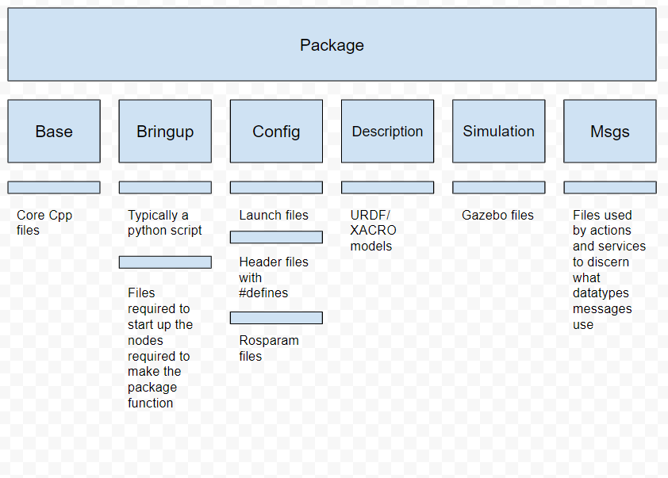
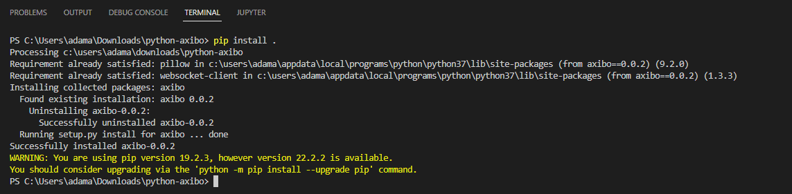

# Semester 1 Midterm Report

**MIT Cheetah Derivative Midterm Report**

**In Collaboration with S.E.P.T. and Axibo Inc.**

PROCTECH 4TR1: Capstone I

Instructor: Mostafa Soliman

Date of Submission: March 9th, 2022

**Declaration Statement:**

This capstone report contains our own work for PROCTECH 4TR1 and has not been submitted, in whole or in part, towards fulfilling requirements in any other course, either at McMaster University or elsewhere.

I/We have read McMaster’s academic integrity policy and understand that plagiarism, whether intentional or unintentional, will be dealt with in accordance with university policy and practice.

| Name             | Student # |
| ---------------- | --------- |
| Adam Sokacz      | 400177446 |
| Amar Gandhi      | 400197665 |
| Dhanesh Manickam | 001422400 |

**Abstract**

This midterm report documents the progress and research done in the development of the MIT Cheetah Derivative capstone project as of March 2022. The report goes over the research results on various quadruped features which include the leg assembly, position control, and the control system. The development thus far has consisted primarily of research, conceptual diagrams and test code. UML diagrams such as use cases, state machines, and system architecture diagrams have been created to outline the functionality of the quadruped. Preliminary C++ example code for testing is provided along with explanations of the concepts behind the code. The key design concepts that are required for the development of the quadruped are outlined. These concepts include inverse kinematics, parts design, programming concepts, and the process control loop block diagram of the system. Lastly, technical details on the current test rig as well as supplies for future test rig updates are detailed.

**Table of Contents**

**Introduction 5**

The MIT Project 5

Collaboration 6

Operation 6

**Literature Review & Project Background 7**

Literature Review 7

Research Results 8

Industrial Standards 12

**Design Concepts and Project Design 13**

Initial Design 13

Design Criteria and Concepts 20

Technical Details and Analysis 23

Supplies 29

**Conclusion 30**

Collaboration 30

Research of Fundamentals 30

Project Pivot 30

Milestones 31

**References 33**

#### &#x20;

#### **Introduction** 

**The MIT Project**

This project is endeavoring to produce a derivative of the MIT Mini Cheetah , a quadruped robot developed in MIT through their biomimetics laboratory. The word _biomimetics_ describes using systems found in nature to inspire technological systems. This can be seen in their approach to the MIT Cheetah through their limb design and control system.

>)

Figure 1: Original MIT Cheetah

There have been multiple interactions and forks of the MIT Cheetah project. The original was designed around the goal of maximizing the force that each leg can produce and implemented a 4-joint leg design. One of the metrics that was analyzed by this design was the force distribution of each leg, once it impacts the ground and at a steady balanced state. The primary metric was speed of the animal-like design when in a gallop. This project was seen primarily as a research initiative to explore feasibility.

>)

Figure 2: MIT Mini Cheetah

A fork of the original Cheetah project was the Cheetah Mini. It consolidated many of the lessons of the previous design into a robust design that could undergo more rigorous testing. One key marketing feature of this iteration was its ability to perform a backflip. Currently, both forks of the design are being developed in parallel, however, the Cheetah Mini has seen more interest from companies hoping to commercialize a product from this research.

**Collaboration**

In collaboration with Axibo Inc. and the project's faculty sponsor Dr. Ishwar Singh, the team is endeavoring to replicate the project under specific goals/constraints outlined by these two stakeholders. Axibo Inc. is looking for a design that can be _cost-effective_ and _commercializable_, and Dr. Ishwar Singh is looking for specific technologies like ROS to be demonstrated so that it can be used as a research and _educational tool_.

For a background on Axibo Inc., they are a startup company started by McMaster alumni in the summer of 2018. They specialize in the application of automation systems in the film industry. They are known for their contributions to autonomous vehicle projects, use of edge computing, and robotics. The Axibo team is in a grown phase and they are beginning to venture into new industries.

**Operation**

* When the user signals the quadruped to power on, it’s on-board systems are initialized and the legs raise it to a preset stable position.
* From the operator workstation with the use of a controller, the operator can manually control the direction that the quadruped walks in.
* On-board vision system replaces the operator input through the controller in setting the direction and speed of the quadrupeds path.

#### &#x20;

#### Literature Review & Project Background 

**Literature Review**

**Dynamic Locomotion**

MIT Biomimetics Lab

_https://biomimetics.mit.edu/research/220579eb-7c43-403e-aebb-bbee478c4663_

Describes the locomotion testing of the original MIT Cheetah. The quadruped was equipped with force sensitive pads on each foot in order to detect the force distribution of each step. This data was graphed, analyzed, and used in the optimization of the design.

**Optimal Actuator Design**

MIT Biomimetics Lab

_https://biomimetics.mit.edu/research/0b02d0a6-b0d3-4011-bd95-183264a30217_

Describes the design of the revolute joints found in the MIT Cheetah leg assembly. It covers the models, gearing, and justifies the design decision that were made.

**High-speed Bounding with the MIT Cheetah 2: Control Design and Experiments**

MIT Biomimetics Lab

_https://dspace.mit.edu/bitstream/handle/1721.1/119686/Bounding-IJRR-Park-Wensing-Kim.pdf?sequence=1\&isAllowed=y_

Describes the design of the gait pattern generator as well as the 3D force analysis for stabilization. These elements were described using vectors and matrices.

**Highly parallelized control programming methodologies using multicore CPU and FPGA for highly dynamic multi-DoF mobile robots, applied to the MIT Cheetah**

Seok, Sangok

_https://dspace.mit.edu/handle/1721.1/87982_

Describes the pipelining process for the cRio microprocessor and the parallel processing in the FPGA embedded within it. Also reviews the Trot running algorithm, which was developed for the project to move the leg in a 12-point bezier loop.

**Software and control design for the MIT Cheetah quadruped robots**

Di Carlo, Jared(Jared J.)

_https://dspace.mit.edu/handle/1721.1/129877_

A report that outlines the specifications of the MIT Cheetah Mini project. It covers everything from a general hardware overview to the simulation and dynamics models used.

**Introduction to Robotics**

Craig, John(John J.)

_https://www.pearson.com/us/higher-education/product/Craig-Introduction-to-Robotics-Mechanics-and-Control-3rd-Edition/9780201543612.html_

The kinematic concepts found in this book were reviewed to reacquaint the team on forwards and reverse kinematics.

**Research Results**

Materials:

The MIT Cheetah Mini was almost completely constructed out of _sheet metal_, although there is not a clear type of sheet metal. This may be because there are multiple versions of the MIT Cheetah project with different specifications. In order to keep the weight reasonable and have a reasonable amount of structural strength for testing, it is likely that sheet aluminum would be best. Aircraft grade sheet aluminum would be ideal because of its size-to-weight ratio, but price will likely drive this decision. Strength will likely be derived more from the geometry of the frame.

Leg Actuation and Modeling

>)

Figure 3: Leg joining diagram

Source: [https://www.semanticscholar.org/paper/MIT-Cheetah-3%3A-Design-and-Control-of-a-Robust%2C-Bledt-Powell/91a19620e40c3bad71b5c52eff40d86eaed32d29/figure/1](https://www.semanticscholar.org/paper/MIT-Cheetah-3%3A-Design-and-Control-of-a-Robust%2C-Bledt-Powell/91a19620e40c3bad71b5c52eff40d86eaed32d29/figure/1)

Leg Assembly:

Each leg is a 3-motor system with feedback position control. Two motors are mounted together in parallel inside the knee assembly. One motor actuates the angle of the _upper link_ while the second motor in the knee assembly actuates the angle of the _lower link_ with the use of a belt and gear system. The _lower link_ is mounted directly to that pulley which intersects both links, changing the angle according to the gear’s rotational position.

Figure 4: Hip abduction-adduction example

The _hip linkage_ is made up of the third motor in the leg assembly. This perpendicularly mounts to the knee assembly and performs the abduction-adduction motion of the leg assembly. _Abduction_ is the pivot away from the body and _adduction_ is the pivot towards the body. The diagram above demonstrates the abduction of the left leg assembly while the right leg assembly remains in its stationary position.

Motor Assembly:

Figure 5: Motor assembly exploded view

Source: [https://dspace.mit.edu/handle/1721.1/87982](https://dspace.mit.edu/handle/1721.1/87982)

The assembly consists of an outrunning motor built into a planetary gearbox. The MIT Cheetah Mini uses a 6:1 gearbox to increase the torque output of the revolute joint. The specifications of this motor are 24V at 7A. It produces a nominal torque of \~7.5 N\*M at a nominal rotational speed of 250 rpm.

Planetary Gearbox:

Figure 6: Planetary gearbox example

The primary benefit of a planetary gearbox over other gearing systems is its form factor. They provide a high rate of energy transfer per unit volume in an enclosed assembly. The motor shaft is typically fixed to the sun gear while the carrier is fixed to the centre of each of the 3 planetary gears. Each planetary gear is allowed free rotation while being mounted to the carrier because of the bearings that connect the two parts together.

>)

Figure 7: Planetary gearbox example 2

With a fixed non-rotating ring gear, the carrier output power is the input power modified by the gear ratio. Planetary gearboxes can be implemented in stages for additional reductions, however multi-stage revolute joints are not suited for quadrupeds due to the additional weight and material on each joint.

Position Control:

The MIT Cheetah Mini uses a dedicated control circuit that receives instructions from the primary node over the CAN bus. A proprietary implementation of this controller outlines the following instruction format:

Example Position Control Instruction:

| Device ID | Data Seg. | Host Addr. | Pos. | 0x00 | Accel. | 0x00 | Target Speed | Pos. L. | Pos. H. |
| --------- | --------- | ---------- | ---- | ---- | ------ | ---- | ------------ | ------- | ------- |

| _**Device ID**_        | A unique identifier must be set for each node on the network.                                                                                                                                                                                                     |
| ---------------------- | ----------------------------------------------------------------------------------------------------------------------------------------------------------------------------------------------------------------------------------------------------------------- |
| _**Data Segment**_     | The number of bytes that will be expected for the instruction. This instruction uses 8-bytes.                                                                                                                                                                     |
| _**Host Address**_     | The address of the primary node on the network.                                                                                                                                                                                                                   |
| _**Position**_         | A 16-bit value. Because of this, the value is stored as two 8-bit numbers. For example, if the position value is 22 000 which represents b’0101 0101 1111 0000, the low position value will store b’11110000 while the high position value will store b’01010101. |
| _**0x00 Instruction**_ | Indicates the type of motion instruction. The hexadecimal value 0x01 represents position control.                                                                                                                                                                 |

Feedback control uses an encoder that is mounted inside of the planetary gearbox assembly and measures the rotation of one of the planet gears. The reading is then modified using the gear ratio to produce an accurate position.

Controller firmware produced by Ben Katz, a PHD researcher working on the MIT project, is available on his ARM MBED profile which can be found at this url:

[https://os.mbed.com/users/benkatz/](https://os.mbed.com/users/benkatz/)

Control System:

The original MIT Cheetah has the following control system layout:

Figure 8: MIT Cheetah System Architecture Block Diagram

_source:_ [_https://dspace.mit.edu/handle/1721.1/126619_](https://dspace.mit.edu/handle/1721.1/126619)

Unlike the Mini Cheetah, the original MIT Cheetah uses force pads on the bottom of each foot, allowing it to make use of the feedback in its PID loop. Swing leg control implements a PID loop to hit each setpoint in its path. The operator GUI is implemented in ROS1 and visualizes joint controls using RVIZ, and there are implementations available for the Gazebo simulator.

**Industrial Standards**

One of the learning objectives and criteria from the faculty sponsor of this project is to use the ROS2 middleware. ROS2 has a structured API for communicating between units of concurrent code called _Nodes_. The API uses a communications technology and standard called _Data Distribution Service_ or DDS. DDS is maintained by a standards organization called _Object Management Group_ (OMG).

The hardware communications technology that was specified by the community partner is called _Controller Area Network Bus_ or CAN Bus. It is a standard communications protocol developed by the automotive industry for reliable communication between microcontrollers without requiring direct connection to a host computer. CAN is internationally standardized as ISO 11898.

#### Design Concepts and Project Design 

**Initial Design**

Objectives:

During initial design, the main objectives of the quadruped robot were established. Firstly, the quadruped robot will be enabled to maneuver in rough terrain, in such cases wheeled robots cannot do so. Adding onto this, the quadruped will be equipped with a self balancing feature, allowing for self correction after disorientation. Self balancing is highly important in a rough terrain environment due to uneven surfaces. This can result in the quadruped being disoriented in its movement requiring the need of self correction. In terms of control, the quadruped can be operated by an individual through a joystick or the quadruped will follow that individual through QR codes. In terms of power, a set of swappable lithium batteries is considered as an objective as the quadruped will be active for moderate periods of time, so a solid battery life is required. Finally, this quadruped will be able to map environments using computer vision. Equipped with a camera system, the quadruped will process camera feeds to detect obstructions and identify QR codes.

Constraints:

As objectives provide the initial scope of the project, constraints are what will limit the quadruped’s capabilities. An objective of the quadruped is to maneuver in different types of terrain, however weather conditions such as rain, hail and snow will act as constraints to this objective. The quadruped will also be able to operate on moist soil, but no mud. Additionally, the quadruped will be able to traverse down slopes up to 40° and up slopes up to 60°. Due to the motivation of this project, the quadruped should be easy to use by operators through a clean graphical user interface. The quadruped is also limited in weight due to two main factors. One being, a lighter weight means easier mobility for the quadruped along with smoother transportation between worksites. Secondly if the weight of the robot is too high, 3D printed parts and joints can be damaged due to high pressure. In the initial design phase, the cost of the robot was still uncertain. Many things such as the motor cost and other materials were not yet specified so an estimated cost of $14,000 was set as a placeholder.

UML Diagrams:

Throughout the design process, a use case, state machine and system architecture diagram were made to help with the design process. Firstly, a use case diagram was constructed to help define the functions and further expand upon the objectives previously established in the initial design phase.

Figure 9: Use Case Diagram

The above use case diagram displays the functions of the quadruped system that was specified in early design. Along with the use cases, actors are surrounding the system. These actors are the users that are interacting with the system. In the quadruped system, there are a total of 9 actors that each in some way, interact with a particular function of the quadruped. Additionally, some of the actors coordinate each other to achieve a desired function. For example, CAN motor control is used to move the quadruped in different directions. _OpenCV_ is used to identify an operator through the use of _QR code_.

Building onto this, a state machine diagram was developed in order to capture the different modes the quadruped will have and how these modes will be activated relative to each other. The state machine diagram consists of 6 states.

>)

Figure 10: State machine diagram, general

The state machine diagram above generally shows how the quadruped robot will run including both the follow and manual modes.

>)

Figure 11: State machine diagram, system initialization and de-initialization

The above diagrams both display how the power de-initialization and initialization work respectively. When powering down, the quadruped will be equipped to show flashing warning lights signaling its powering down. From this, it will terminate the video stream deriving from OpenCV and the quadruped will go to a lying down position. Once this is complete, warning lights will become solid and the microprocessor will be powering down, turning off the warning lights. Similarly, when powering up, warning lights will again be used to help with signaling and indication.

>)

Figure 12: State machine diagram, manual mode

This state goes into depth with respect to the manual mode of the quadruped. Once quadruped is set to manual mode, the quadruped will be controllable through a joystick. When the quadruped receives a move command from the joystick, a path will be created. Using dynamic gait control, the system will be able to move using an accelerometer and pressure sensors to balance.

>)

Figure 13: State machine diagram, follow mode

In follow mode, instead of the operator controlling the quadruped through a joystick, the quadruped will follow the operator. This will be done through the use of QR code. An operator will be given a valid QR code for the quadruped to recognize. In this mode, OpenCV will need to be utilized for this to be possible. The quadruped will start searching for a target when set to follow mode. Once a QR code is found, it will calculate the operator’s position relative to its own position by calculating how far the distance of the QR code is. It will then communicate this position back to the controller node so it can reach the position of the operator.

>)

Figure 14: State machine diagram, QR code recognition

This state explains the QR code process more in depth. For the quadruped to run in follow mode, the OpenCV library within python is utilized for computer vision. Once the quadruped is set to follow mode, it will enable OpenCV to activate. The program will be getting the QR code through video capture. It will then read the video capture and use the decode function from the pyzbar.pyzbar library, to search for a QR code. If there is no QR code detected, then an invalid message will occur. The decode function will also be looped as the quadruped will continuously look for a target in follow mode. If there is detection, it will then move onto calculating the QR code’s position from the quadruped to generate motion instructions.

>)

Figure 15: Main python script for QR Code recognition

The python script above describes the general structure on how the QR recognition process will function for the quadruped robot. The openCV and _numpy_ libraries are first imported into the program. Along with this, the decode function within the _pyzbar_ library is imported as well. This decode function is specifically used for QR and barcode recognition.

>)

Figure 16: Decode function

Taking a closer look at the decode function, which is available in the open source pyzbar library, allows for a QR or barcode to be read into the function from an image or a video stream. In this case, the QR code is a jpeg file. The jpeg file is then taken into the decode function. The function then calculates if the given image is either a barcode or a QR code.

Figure 16: Output

Upon successful execution of the python script, the result of the decode function will be called back into the main function. The type of code will be displayed along with the bounding rectangle box. X and y coordinates of the polygon are also displayed as not all QR and barcodes reside in a perfect rectangle, hence a polygon exists. Since the image decoded is a QR code, the result will spit out “type= ‘QRCODE’.” This means that there is successful recognition of the given QR code allowing for the quadruped to proceed with its next process.

>)

Figure 17: System architecture diagram

Finally, a system architecture diagram was made to decompose the quadruped robot to visually interpret the different subsystems within. This diagram indicates that there are 6 subsystems within the overall quadruped system. Each component in the quadruped belongs to a different subgroup to help organize the quadruped system. For example, the battery belongs to the power subgroup. The software subgroup consists of the self balancing program, the computer vision program and the dynamic gait control system for movement.

**Design Criteria and Concepts**

The design for the quadruped robot will be a derivation of the MIT Mini Cheetah. The robot will have four legs each with three actuators allowing for 3 degrees of freedom. The construction of the robot will utilize 3D printed parts, sheet metal parts, machined metal brackets, and off the shelf sensors, micro controllers, and motor drivers.

The concepts used in the design of this robot will include inverse kinematics, motor control, process feedback and control loops(PID), part design with 3D printing and sheet metal, electrical circuits, hardware/software compatibility and integration, computer vision, and programming. For the programming side, C++ and Python will be used in conjunction with ROS2 middleware. The majority of the functions and locomotion processes will be done in C++ and the vision system and follow mode pathing will be done in Python. ROS2 will serve as the middleware for the C++ and Python code, as well as running simulations using _RViz_.

Figure 18: Inverse kinematics model

Inverse kinematics is the concept of determining the angle of each joint to position the end point at a desired location. The challenge with inverse kinematics is that there can be multiple solutions to position the joints to achieve the same end position. Due to this further analysis is required to determine which solution is optimal.

There are multiple methods that can be used in inverse kinematic calculations. Three of the methods are trigonometry, _Jacobian matrix method_, and the trial and error approach. The trigonometry method uses simple trigonometry calculations as an effective approach when dealing with a low number of joints. The Jacobian matrix method uses matrix calculations to solve for the solutions and is the preferred method when there are many joints in the arm (4+). Lastly, the trial and error method is a brute force approach to finding a solution through incremental testing. This is a viable method when using software to compute the results however it is slow and inefficient. For the application of a quadruped robot, fast continuous calculations will be required therefore the trigonometric and Jacobian matrix method is preferred.

The use of inverse kinematics will be a key concept that will be used in programming the locomotion of the quadruped. The robot will have 4 legs, each with 3 degrees of freedom. With each move of a leg the inverse kinematics will have to be calculated to determine what angle to position each of the three motors at while also eliminating non optimal solutions. Since these calculations will have to be done in real time on the robot it is important that the calculations can be done quickly, which means trigonometry and the Jacobian matrix method would be optimal as the trial and error method is slower and less efficient.

Figure 19: Process control loop block diagram

The general _feedback control loop_ is shown above. It begins with the setpoint into the system, which in the case of the manual control mode will be the joystick input and for the follow mode the setpoint will be the motion instructions generated by the camera pathing system. The setpoint then goes onto the _Gait Generator_ which determines the positions of the feet. The concept behind gait is the kinematics in the way legged things move. The Gait Generator in this system will have multiple modes of motion including, crawling, trotting, and walking. Using the position of the feet from the Gait Generator, inverse kinematics is done to determine the angles to move each motor to. The output of the inverse kinematics becomes the setpoint to the PID control loop, with positional feedback from the encoders on the motor. The PID will be the one that controls the actual motors on the robot and what the response curve will be like. The robot will have an additional feedback loop using an accelerometer and a balancing program to account for any disturbances.

There will be three manufacturing processes used for the construction of the robot, those being 3D printing, sheet metal parts, and machined metal parts. The 3D printed parts will be used for components that will not experience high loads, like certain leg components and internal components. The advantage with 3D printing is that it is highly customizable and allows for rapid prototyping and a relatively low cost per part. The sheet metal components will be used for the body exterior and parts of the leg. This is for lightness as we can use sheet metal aluminum for the body exterior and for the leg components folded sheet metal will provide more durability for the high stress areas than a 3D printed part. Lastly, machined metal parts will be used for the highest stress areas such as the motor housings and the motor mounting brackets. These parts will be designed using a combination of Fusion 360, Autodesk Inventor, and Solid Works.

**Technical Details and Analysis**

Modeling Leg Position

Each leg of the quadruped can be broken down into two distinct parts that must work together to position the leg in 3D space. These parts are the knee assembly and the hip assembly. The knee assembly is restricted to a 2D plane of motion. This allows the rotation of the two revolute joints to be modeled through inverse kinematic equations based on simple geometric relationships.

The following is a function implemented in C++ which calculates the angle of each corresponding revolute joint based on a goal position (x, y):

>)

Figure 20: Example C++ code, inverse kinematics angle calculations

Unit conversions:

Figure 21: Example C++ code, unit conversions

In order to check if this is an acceptable position, pythagorean theorem can be used to find the length of the vector.

Figure 22: Proof of concept diagram using pythagorean theorem

However, when coordinates are determined in 3D, the acceptable area of motion has an additional dimension to it.

Figure 23: Diagram of the range of motion of hip joint

The pythagorean equation in 3D can be used to find the sphere of reach:

c = sqrt(x2 + y2 + z2)

In order to break down a 3D coordinate into a 2D movement + an angular position, that 3D coordinate must be projected on a 2D angled plane, where theta in the image below represents the angle of the plane:

Figure 24: 3D space broken down into a 2D plane + an angular position

In this situation, the z translation can be represented by the opposite side of the triangle created. The length of the vector from the origin to the point is the hypotenuse. The angle can be calculated using arccos(). Since the plane is only tilted in one dimension, xplane = xglobal. Lastly, Yplane become stretched since the hypotenuse is longer than the adjacent angle.

Figure 21 below shows a preliminary implementation of this concept.

Figure 25: Sample C++ code of 2D plane + an angular position model

Sampling an Ellipse

The MIT Cheetah typically makes an elliptical motion with its legs to walk. From one of the math courses, we learned that an ellipse can be modeled by the following equation:

Figure 26: Equation of an ellipse

Source: [https://cdn.virtualnerd.com/thumbnails/Alg2\_10\_02\_0012-diagram\_thumb-lg.png](https://cdn.virtualnerd.com/thumbnails/Alg2\_10\_02\_0012-diagram\_thumb-lg.png)

The issue comes with sampling along the perimeter of the function. The perimeter can be approximated by a number of different methods. Google favours this one:

Figure 27: Circumference of an ellipse formula

Source: google.com

However, it becomes difficult to calculate the end coordinates when given the starting coordinate and amount to travel along the elliptical path.

One strategy to avoid this is to use _exponential sampling,_ meaning that the frequency of samples is increased the closer each sample reaches the horizontal axis of the ellipse. This would require the tuning of the exponential function for each ellipses specification to get points that are near a uniform distribution along the elliptical path. Because of this, the solution is not good.

I tried it out on one quadrant of an ellipse anyways:

Figure 28: Example of exponential sampling on an ellipse

Figure 29: Sample C++ code for sampling an elliptical path

PID Controller in C++

Figure 30: Block diagram of a PID controlled process

It is important for the joints in the leg assembly of the quadruped to be reactive to disturbances. It is one of the criteria set by our community partner that the quadruped must balance itself when acted on by the outside world. There will be multiple levels of PID that will be used in this project. The first being individual joint PID. This will determine how quickly the joint responds to a position command and how conservatively it holds that position. The next is the coordination of each leg assembly. The individual leg assembly setpoints are generated through an algorithm called a _gait pattern generator_. Once these setpoints are passed to the individual leg assemblies, they are acted on by their local PID.

There are a variety of PID controller implementations available to view in C++. While many of them are simple, there is a distinct difference in complexity between commercial implementations and hobby implementations. Two examples of added complexity are anti-windup and output filters in order to prevent the controller from going out-of-control when the controller in specific configurations is confronted by a wide variety of disturbances.

The following site was referenced to better understand these addition features:

[https://tttapa.github.io/Pages/Arduino/Control-Theory/Motor-Fader/PID-Cpp-Implementation.html](https://tttapa.github.io/Pages/Arduino/Control-Theory/Motor-Fader/PID-Cpp-Implementation.html)

The following repository was reviewed in searching for a real-world implementation. This firmware is maintained by one of the researchers involved with the MIT Cheetah project.

[https://github.com/bgkatz/motorcontrol/blob/master/Core/Src/main.c](https://github.com/bgkatz/motorcontrol/blob/master/Core/Src/main.c)

It has been difficult to test code regarding PID control because of our lack of hardware at the moment, but that will change in the next week.

Initial Testing Rig

Figure 31: Preliminary testing code, menu screen

Before purchasing hardware, it was realized that some of the kinematics concepts that have been learned could be tested on a set of servos without requiring feedback control hardware. This would allow the group to experiment with pathing techniques and better understand how to apply them in 3D space. In order to do this, some functions were implemented in arduino code and used to control the servo rig. However, as the program complexity grew, it began taking a while to compute so it is currently being ported to the Raspberry Pi. Once a path is generated, the user can view the coordinates and angles of each joint and export to a text file for further visualization in excel. From feedback from the Axibo Inc. the next steps will be to use a graphing library to help provide a more intuitive and automatic representation of each coordinate and motion.

**Supplies**

The team believes that the most complicated aspect of this project will be the application of each leg and the coordination of all 4. In order to perform _more representative testing_, the team is looking to purchase a testing rig made up of premade controllers and motors. This testing will largely continue into the summer so that the entire project can be consolidated in the fall semester.

Figure 32: Test kit BOM

#### Conclusion 

In conclusion, the research and planning phase of SEPT-Axibo Cheetah Derivative has been progressing at an acceptable pace. In alignment with our objectives, the development of this quadruped has proven to be a valuable learning platform for many robotic design and engineering concepts. The following three sections connect the content of this report with our action plan for the future.

**Collaboration**

The _bi-weekly meetings_ with the community partner and faculty sponsor have been occurring consistently and given us the opportunity to get feedback on our progress and set goals for the following two weeks. We have met and collaborated with Paritosh, the Manufacturing M.Eng. student assigned to lead the mechanical development of the project, on a semi-weekly basis for the past 3 weeks so that we can put input as the revolute joint becomes finalized. The core capstone team (Dhanesh, Amar, Adam) have been meeting a total of 3 times per week since the 4th week of the semester to ensure consistent progress. This typically occurs Monday (during class), Thursday, and Saturday.

**Research of Fundamentals**

Research of fundamentals describes the understanding of the subsystems of the MIT Cheetah Mini project, as well as similar projects. As a team, we reviewed many technical documents which lead to the flow decisions found in the UML diagrams contained in this report. Going forward, we have completed our fundamental research and have begun dividing up more specialized aspects of the project to each team member. Adam has taken on C++ algorithms and CAD modelling, Dhanesh has taken on the modifying existing simulations in ROS2, and Amar is continuing to focus on the computer vision processes and specifically working on a minimum viable prototype to begin attempting to connect it to a gait control process.

**Project Pivot**

After presenting our midterm progress update to our community partner and faculty sponsor, there was a discussion about budget, commercializability, and the project scope that each stakeholder is interested in, based on our research and updated financial estimates. Dr. Ishwar Singh is more interested in the research and simulation aspect, while Axibo Inc. wants a commercial product with new mechanical requirements for the load that it can carry. The difference in goals was already considered in the beginning of the semester but going forward, the role of our capstone team may focus more towards the simulation and controls aspect of the project. This change will allow each _stakeholder_ the _flexibility_ to work towards their intended application of the project. Once the controls and simulation aspect has been developed and documented, it will be passed forward to Axibo Inc. towards their project, which will take multiple revisions and safety considerations to become commercially viable.

**Milestones**

Figure 33: March milestones

#### References 

Design principles for multi-axis, large force magnitude sensor arrays for use in human and robotic applications. biomimetics.mit.edu. (n.d.). Retrieved March 7, 2022, from https://biomimetics.mit.edu/research/220579eb-7c43-403e-aebb-bbee478c4663 ​

​

Derek-TH-Wang. (n.d.). Derek-th-Wang/quadruped\_ctrl: MIT Mini Cheetah Quadruped Robot Simulated in pybullet environment using ROS. GitHub. Retrieved March 7, 2022, from https://github.com/Derek-TH-Wang/quadruped\_ctrl​

​

Optimal Actuator Design. biomimetics.mit.edu. (n.d.). Retrieved March 7, 2022, from https://biomimetics.mit.edu/research/0b02d0a6-b0d3-4011-bd95-183264a30217 ​

​

Quadruped bounding control with variable ... - dspace.mit.edu. (n.d.). Retrieved March 7, 2022, from https://dspace.mit.edu/bitstream/handle/1721.1/90290/Kim\_Quadruped%20Bounding.pdf;sequence=1 ​

​

Di Carlo, J. J. J. (1970, January 1). Software and control design for the MIT Cheetah Quadruped Robots. Software and control design for the MIT Cheetah quadruped robots. Retrieved March 7, 2022, from https://dspace.mit.edu/handle/1721.1/129877 ​

​

Craig, J. J. (n.d.). Introduction to robotics: Mechanics and control. Pearson. Retrieved March 7, 2022, from https://www.pearson.com/us/higher-education/product/Craig-Introduction-to-Robotics-Mechanics-and-Control-3rd-Edition/9780201543612.html ​
