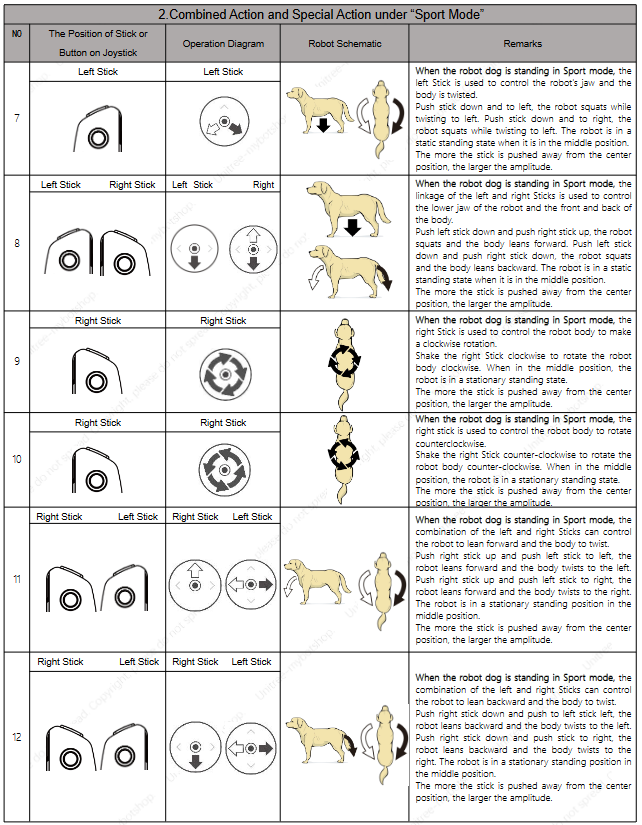

# Unitree G1

Hardware Architecture:

.png>)

Standing State Mode:

* Low power consumption
* Joystick is non responsive

A-Mode:

* Adjust the height and pose of the quadruped in a stationary position

W-Mode (Walking):

* Quadruped determines walking kinematics based on joystick orientation

Sport Mode:

* Strong adaptability to irregular terrain
* Will dampen forces on each of the limbs

Battery Charging Indicators:

.png>)

Controller Operation:

.png>)

.png>)

Controller Phone App: [https://m.unitree.com/app](https://m.unitree.com/app)

Manual A:&#x20;



Manual B:


